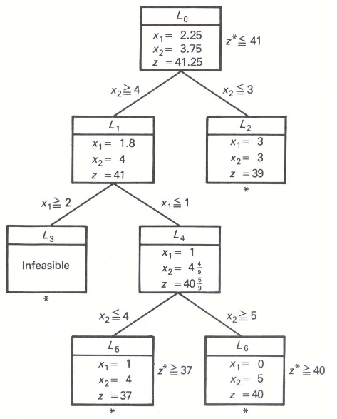

# Programmation Linéaire

## Problème

### Définitions

 * z: fonction de coût que l'on cherche à minimiser/maximiser

### Forme canonique

$$
max z = \sum_{i = 1}^{n} c_i x_i \\
subject\ to : \mathit{A}x \le b
$$

Avec $\mathit{A} \in \mathbb{R}^{m \times n}$ et $b \in \mathbb{R}^n$

### Forme standard

Introduction des variables d'écart de m varia $u$

$$
max z = \sum_{i = 1}^{n} c_i x_i \\
subject\ to : \mathit{A}x + u = b
$$

Avec $u_j \ge 0$

### Variables en Base/Hors Base

 * n varibles hors base (VHB) = 0
 * m variables en base (VB) $\ne$ 0

$$
\max z = \boxed{4x_1 + 3x_2} VHB \\
s.t. \\
\boxed{
\left|\begin{matrix}
u_1 \\
u_2 \\
u_3 \\
VB \\
\end{matrix}\right.
}
\left.\begin{matrix}
 = &  8 & - & x_1 &   &     \\
 = &  6 &   &     & - & x_2 \\
 = & 15 & - & x_1 & - & x_2 \\
\end{matrix}\right.\\
x_1, x_2 \ge 0
$$

## Résolution avec le Simplexe

### Phase 1: Choix d'une base de départ / Solution initiale

#### Phase 1.1: Trouver une base de départ

Si pas de base évidente (exemple $\overrightarrow{0}$), on transforme/ré-écrit le problème pour en trouver une:

Exemple:
$$
\max z = 4x_1 + 2x_2 \\
s.t. \\
\left|\begin{matrix}
3x_1 & + & 2x_2 & \le & 12 \\
 x_1 &   &      & \ge &  3 \\
 x_1 & + & 2x_2 &  =  &  4 \\
\end{matrix}\right.\\
x_1, x_2 \ge 0
$$

 * Introduction des variables d'écarts
 * Introduction des variables artificielles
 * Nouvel objectif

$$
\min\ \psi = a_2 + a_3 \\
s.t. \\
\left|\begin{matrix}
3x_1 & + & 2x_2 & + & u_1 & = & 12 \\
 x_1 & - & u_2  & + & a_2 & = &  3 \\
 x_1 & + & 2x_2 & + & a_3 &=  &  4 \\
\end{matrix}\right.\\
x_1, x_2, u_1, u_2, a_2, a_3 \ge 0
$$

Objectif: $\psi = 0$ sinon, pas de base de départ/pas de solution.
Le résultat de ce PL est la base initiale.

#### Phase 1.2: ré-écriture du PL dans la nouvelle base

### Phase 2: Choix de la variable qui entre en base

 * Variable qui entre

$$\max z = 4 \boxed{x_1} + 3 x_2$$

x_1 est la variable la plus intéressante. Elle fait augmenter le plus la fonction objective.

 * Variable qui sort

$$
\left.\begin{matrix}
u_1 & = &  8 & - & x_1 & \ge & 0 & (1) \\
u_2 & = &  6 &   &     & \ge & 0 & (2) \\
u_3 & = & 15 & - & x_1 & \ge & 0 & (3) \\
\end{matrix}\right.
$$

L'équation (1) est la plus contraignante. $u_1$ entre en base.
On remplace $x_1$ par sa valeur issue de (1): $8 - u_1$.

$$
\max z = 4 * (8 - u_1) + 3 x_2 \\
\left.\begin{matrix}
x_1 & = &  8 & - & u_1 & \ge & 0 & (1) \\
u_2 & = &  6 &   &     & \ge & 0 & (2) \\
u_3 & = & 15 & - & x_1 & \ge & 0 & (3) \\
\end{matrix}\right.
$$

### Phase 3: arrêt?

Conditions d'arrêts:

 * Paramètres de la fonction objectif négatif
 * Boucle sur les variables entrant en base

### Phase 4: solution

Les variables hors base sont égales à 0. 
La fonction objective et les variables en base sont égales à la constante de leur équation.

# Dualité

## Formulation

A tout problème de maximisation P correspond un problème de minimisation D:

$$
max (P) = min (D) \\
Primal\ \ Dual \\
Var Primal = Contraintes Dual \\
Contraintes Primal = Var Dual
$$


$$
(P) \left\{\begin{matrix}
\max z = c x \\
s.t. : \mathit{A}x \le b
\end{matrix}\right.
\Leftrightarrow 
(D) \left\{\begin{matrix}
\min w = y \  b \\
s.t. : y \mathit{A} \ge c
\end{matrix}\right.
$$

## Cas général

$$
\begin{matrix}
min & max \\
Fonction\ objective & Second\ membre \\
Matrice\ de\ contraintes\ A & Matrice\ de\ contraintes\ A^t \\
x_i \ge 0 & Contrainte\ i\ de\ type\ \le \\
x_i \le 0 & Contrainte\ i\ de\ type\ \ge \\
x_i \in \mathbb{R} & Contrainte\ i\ de\ type\ = \\
Contrainte\ i\ \le, \ge ou = & y_i \ge 0, \le 0\ ou \in \mathbb{R} \\
x_i\ en\ base & y_{\hat{j}}\ hors\ base \\
\end{matrix}
$$

## Ecarts complémentaires

Si $\hat{x}$ est une solution admissible de (P) et $\hat{y}$, une solution de (D), alors:

$$
\left|
\begin{matrix}
\hat{x_i} & \times & (\sum \hat{y_j} a_{ij} - c_j) & = & 0 \\
\hat{y_j} & \times & (b_i - \sum a_{ij} \hat{x_i}) & = & 0
\end{matrix}
\right.
$$

On retrouve les solutions du primal à partir du dual.

# Analyse en sensibilité

L'analyse en sensibilité a pour but d'étudier l'évolution de la solution lorsque l'on fait varier la solution optimale.

## Définitions

###  Coût marginal

> Augmentation minimale de dépenses, par rapport à la solution optimale, qui résulterait de l’utilisation d’une unité supplémentaire de ce bien, lorsque le problème posé consiste à produire des biens au moindre coût [source](https://www.cours-et-exercices.com/2016/03/dualite-et-analyse-de-sensibilite-cours.html#Heading3)

## PL exemple

$$
\begin{matrix}
\max Z = 4 x_1 + 3 x_2 \\
s.t. \left|\begin{matrix}
x_1 &   &      & \le & 8 \\
    &   &  x_2 & \le & 6 \\
x_1 & + & 2x_2 & \le & 16 \\
\end{matrix}\right.
\end{matrix}

\Rightarrow


\begin{matrix}
\max Z = 44 - \dfrac{1}{2} u_1 - 3 u_3 \\
s.t. \left|\begin{matrix}
x_1 & = & 8 &  & & - u_1 & & \\
u_2 & = & 2 &  & & - \dfrac{1}{2} u_1 & + u_3 & \\
x_2 & = & 4 &  & & + \dfrac{1}{2} u_1 & - u_3 & \\
\end{matrix}\right.
\end{matrix}
$$ 


## Fonction Objective

On remplace le paramètre C pour la variable $x_1$ par $\alpha$ : 
$$
Z_\alpha = \alpha\ x_1 + 3 x2 \\
s.t. \left|\begin{matrix}
x_1 &   &      & \le & 8 \\
    &   &  x_2 & \le & 6 \\
x_1 & + & 2x_2 & \le & 16 \\
\end{matrix}\right.
$$
avec $\alpha \in \mathbb{R}$

Comme le résultat du PL ne doit pas changer, on a les mêmes variables hors base et en base. On remplace donc $x_1$ par sa valeur: 

$$
\begin{matrix}
\max Z = \alpha * (8 - u_1) + 3 * (4 + \dfrac{1}{2} u_1 - u_3) \\
s.t. \left|\begin{matrix}
x_1 & = & 8 &  & & - u_1 & & \\
u_2 & = & 2 &  & & - \dfrac{1}{2} u_1 & + u_3 & \\
x_2 & = & 4 &  & & + \dfrac{1}{2} u_1 & - u_3 & \\
\end{matrix}\right.
\end{matrix}

\Rightarrow

\begin{matrix}
\max Z = (\alpha * 8 + 12) + (-\alpha + 3/2) * u_1 - 3 * u_3 \\
s.t. \left|\begin{matrix}
x_1 & = & 8 &  & & - u_1 & & \\
u_2 & = & 2 &  & & - \dfrac{1}{2} u_1 & + u_3 & \\
x_2 & = & 4 &  & & + \dfrac{1}{2} u_1 & - u_3 & \\
\end{matrix}\right.
\end{matrix}
$$ 

Le PL reste stable tant que $(-\alpha + 3/2) \le 0 => 3/2 <= \alpha$.
Pour chaque augmentation d'alpha, l'objectif augmente de 8.

## Second membre

$$
Z = x_1 + 3 x2 \\
s.t. \left|\begin{matrix}
x_1 &   &      & \le & 8 + \alpha\\
    &   &  x_2 & \le & 6 \\
x_1 & + & 2x_2 & \le & 16 \\
\end{matrix}\right.
$$

En passant en forme standard: 

$$
Z = \ x_1 + 3 x2 \\
s.t. \left|\begin{matrix}
u_1 - \alpha & = & 8   & - & x_1 \\
u_2 & = & 6   &   &     & - &  x_2 \\
u_3 & = & 16  & - & x_1 & + & 2x_2 \\
\end{matrix}\right.
$$

En posant $\hat{U_1} = u_1 - \alpha$, le PL reste le même.
On a donc:

$$
\begin{matrix}
\max Z = 44 - \dfrac{1}{2} \hat{U_1} - 3 u_3 \\
s.t. \left|\begin{matrix}
x_1 & = & 8 & - & \hat{U_1} \\
u_2 & = & 2 & - & \dfrac{1}{2} \hat{U_1} & + u_3 \\
x_2 & = & 4 & + & \dfrac{1}{2} \hat{U_1} & - u_3 \\
\end{matrix}\right.
\end{matrix}

\Rightarrow

\begin{matrix}
\max Z = 44 - \dfrac{1}{2} (u_1 - \alpha) - 3 u_3 = (44 + \dfrac{1}{2} \alpha) - \dfrac{1}{2} u_1 - 3 u_3 \\
s.t. \left|\begin{matrix}
x_1 & = & 8 & - & (u_1 - \alpha)\\
u_2 & = & 2 & - & \dfrac{1}{2} (u_1 - \alpha) & + u_3 \\
x_2 & = & 4 & + & \dfrac{1}{2} (u_1 - \alpha) & - u_3 \\
\end{matrix}\right.
\end{matrix}
$$

Quand $\alpha$ augmente de 1, l'objectif augmente de 0.5. Le domaine de $\alpha$ se trouve avec les contraintes et en mettant les variables hors base à 0 :

$$
\begin{matrix}
\left|\begin{matrix}
8 & + \alpha & \ge & 0 \\
2 & + & \dfrac{1}{2} \alpha & \ge & 0 \\
4 & - & \dfrac{1}{2} \alpha & \ge & 0 \\
\end{matrix}\right.
\end{matrix}

\Rightarrow

-4 \le \alpha \le 8
$$

# Formulation problèmes courants

## Problème du sac à dos

L'objet i a les propriétés suivantes:

 - Un poids $w_i$
 - Un coût $c_i$
 - Un variable $x_i$ qui vaut 1 si l'objet est chargé.

On cherche à maximiser la coût d'objets chargés dans le sac à dos sans dépasser la capacité C du sca.

$$
\max z = \sum x_{i} c_{i} \\
s.t. 
\sum x_{i}  w_{i} \le c \\
$$

## Max flow

$$
\max z = \sum x_{ij} \times w_{ij} \\
s.t. 
\sum f_{ij} = \sum f_{ji}, \forall v \in \mathbb{V} - \{s, t\} \ (1)
$$

La contrainte (1) est la règle de conservation des flux.

## Plus court chemin

Plus court chemin pour aller du noeud s au noeud t

$$
\min z = \sum x_{ij} \times w_{ij} \\
s.t. 
 \left|\begin{matrix}
 \sum x_{ij} & - & \sum x_{ks} & = & 0 & (1)\\ 
 \sum x_{si} & - & \sum x_{is} & = & 1 \\ 
 \sum x_{ti} & - & \sum x_{it} & = & -1 \\ 
\end{matrix}\right.
$$

On modélise le plus court chemin comme un problème de flot max avec un flux égal à 1.

## Bin packing

**Objectif**: ranger les objets dans un minimum de boites

Soit les variables suivantes:
 
  - $x_i$ égal à 1 si la boite i est utilisé.
  - $y_{ij}$ égal à 1 si l'objet j est dans la boite i

Soit les paramètres suivants:

  - $c_j$, le coût de l'objet j
  - $C_i$, la capacité d'un boite i

$$
\min z = \sum x_i \\
s.t. 
 \left|\begin{matrix}
 \sum y_{ij} c_j & \le & C_i & \forall i & (1)\\ 
 \sum y_{ij} & \le & x_i & \forall i & (2) \\
 \sum y_{ij} & = & 1 & \forall j & (3) \\
\end{matrix}\right.
$$

Contraintes:

 - L'inégalité 1 assure qu'il n'y a pas plus d'objets que la boite peut contenir
 - L'inégalité 2 assure que, si la boite contient un objet, alors $x_i$ vaut 1
 - L'inégalité 3 assure que tous les objets sont bien placés dans une boite


## TSP

$$
\min z = \sum c_{ij} x_{ij} \\
s.t. 
 \left|\begin{matrix}
 \sum_{i=1}^N x_{ij} & = 1 & \forall j & (1)\\ 
 \sum_{j=1}^N x_{ij} & = 1 & \forall j & (2)\\ 

 t_1 = 1 (3) \\ 
 2 \le u_i \le n (3) \\
 t_i - B(1 - x_{ij}) & \le t_j & \forall i,j & (3)\\ 
 
 \sum_{(i,j) \in E} x_{ij} & \le |S| - 1 & \forall S \in V, V \ne S & (3')\\ 
\
end{matrix}\right.
$$

Contraintes:
 - Les contraintes (1) et (2) assurent que tous les neouds sont visités une fois (on utilise un arc pour entrée et un pour sortir)
  - Pour éliminer les sous-tours, on a le choix avec une des deux contraintes
    * (3) : Miller, Tucker, Zemlin: on ajoute une contrainte temporelle (B est une valeur très grande). Pareil que $u_i - u_j + 1 \le (n-1)(1-x_{ij})$? Si $x_{ij} = 0$, il n'y a pas de contrainte entre $u_i$ et $u_j$. Sinon $u_j$ doit être plus grand que $_ui$ d'au moins 1.
    * (3') : Dantzig, Fulkerson, Jhonson: Quel que soit un sous-graphe de G, les liens utilisés forment une chaîne.

Pour la contrainte (3') Cependant, on a $2^{|S|}$ parties possibles, rendant ce modèle non compact. Pour résoudre ce problème, on peut utiliser une approche itérative

 0. Créer le problème avec (1) et (2)
 1. Résoudre le problème
 1. Si le problème ne contient pas de des sous-tours, retourner le résultat
 2. Si le problème contient des des sous-tours, ajouter une contrainte (3') pour empêcher le sous-tour
 3. Retourner à 1

Réf:

 - [Exemple d'implémentation](https://medium.com/swlh/techniques-for-subtour-elimination-in-traveling-salesman-problem-theory-and-implementation-in-71942e0baf0c)
 - Capacitated Multitrip Vehicle-Routing Problem With Time Window
 - Multi-depot vehicle routing problem

## Location facility

Minimiser le coût d'installation des entrepôts

Paramètres:

 - $d_i$: coût d'installation de l'entrepôt sur le site i
 - $c_{ij}$: coût pour livrer le client j depuis le site i

Variables:

 - $x_i$: égale à 1 si l'entrepôt est placé sur le site i
 - $y_{ij}$: égale à 1 si l'u

$$
\min \sum_i \sum_j c_{ij} y_{ij} + \sum_j d_i x_i \\
s.t. \\
\sum_i y_{ij} = 1 \forall j (1) \\
\sum_j y_ij \lt x_i \forall i (2)
$$

Contraintes:

 - (1): assure que tous les clients sont servis
 - (2): si $y_{ij}$ alors $x_i$ - si le client j est servi par l'entrepôt i, alors l'entrepôt est installé en i

## Minimize makespan on parallel machines

On a j objets à produire sur i machines. Chaque objet prend p_j minutes à produire.

$x_{ij} = 1$ si l'objet j est associé à la machine j

On cherche à minimiser la fin du traitement w.

$$
\min w \\
s.t.\\
w >= \sum p_j x_{ij} \forall i \in I (1)\\
\sum x_{ij} = 1 \forall j \in J (2)\\
$$

La contrainte (1) contraint la durée w à être supérieure à la machine avec le plus long fonctionnement.
La contrainte (2) assure qu'un objet est produit une fois par une machine.

# Divers

## Résoudre le problème

```python
import pyomo.environ as pyo 

m    = pyo.ConcreteModel()
m.x  = pyo.Var([1,2], domain=pyo.NonNegativeReals)
m.z  = pyo.Objective(expr = 4 * m.x[1] + 3 * m.x[2], sense=pyo.maximize)
m.c1 = pyo.Constraint(expr = m.x[1] <= 8)
m.c2 = pyo.Constraint(expr = m.x[2] <= 6)
m.c3 = pyo.Constraint(expr = m.x[1] + 2 * m.x[2] <= 16)

opt = pyo.SolverFactory('cbc')
results = opt.solve(m)

from pyomo.opt import SolverStatus, TerminationCondition
if results.solver.status == SolverStatus.ok and results.solver.termination_condition == SolverStatus.OK:
    print(f"x1 = {m.x[1].value}, x2 = {m.x[2].value}")
```

# Résolutions de problèmes difficiles

## Branch-and-bound / Branch-and-cut

L'algorithme "Branch-and-bound" est basée sur une stratégie "diviser pour régner" (divide and conquer). L'idée est de partitionner l'espace des solutions en sous-ensembles que l'on cherche à résoudre.

Considérons un problème de maximisation avec des variables entières.

On trouve une solution optimale en relachant les contraintes d'intégrité sur les variables
 * Si le PL n'a pas de solution alors on arrête l'évaluation de cette branche
 * Si la solution est entière => on peut s'arrêter. Il s'agit de la meilleure solution sur cette branche. Cela donne aussi une borne minimale au problème.
 * Si la valeur de la objective issue de la relaxation est inférieure à une solution acceptable du problème (respectant les contraintes d'intégrité), on arrête. On ne pourra pas trouver une solution encore meilleure que la solution acceptable.
 * Sinon, on choisit une variable et on subdivise l'espace en deux: x_i <= |x| et |x| >= x_i et on recommence. On peut remarque qu'en ajoutant ces contraintes, on exclue la solution trouvée précédemment.

Soit le PL suivant issu de https://web.mit.edu/15.053/www/AMP-Chapter-09.pdf: 

$$
\begin{matrix}
\max Z = 5 x_1 + 8 x_2 \\
s.t. \left|\begin{matrix}
x_1 & + x_2 & \le & 6 & (1)\\
5 x_1 & + 9 x_2 & \le & 45 & (2)\\
x_1 , & x_2 & \in & \mathbb{N} & (3)
\end{matrix}\right.
\end{matrix}
$$

* **Etape 0**: On relaxe les contraintes d'intégrité (3), on résoud le PL ce qui nous donne une valeur objective  $z_0 = 41.25$. La valeur de la fonction objective de la  meilleure solution faisable de ce PL est forcément inférieur à 41.
* **Etape 1**: On partitionne l'arbre en deux. On choisit d'évaluer L1.
* **Etape 2**: On partitionne l'arbre en deux. 
* **Etape 2.1**: On choisit d'évaluer L2. L2 n'est pas faisable, on arrête l'évaluation de la branche L2.
* **Etape 2.2**: On évalue L4. On partionnne, on évalue L5. La solution est entière, on a donc une borne minimale de notre fonction objective: $37 \le z \le 41$. On évalut L6. On trouve une solution entière et une nouvelle borne meilleure que la précédente:  $40 \le z \le 41$
* **Etape 3**: On évalue L2. La valeur de la solution optimale est inférieue à la borne précédente:  $39 \le 40 \le z \le 41$. On peut arrêter l'évaluation de L2.

Ce qui donne l'arbre suivant:

 

## Relaxation Lagrangienne

Le principe de la relaxation lagrangian est d'inclure les contraintes difficiles dans la fonction objective et de chercher à optimiser successivement les multiplicateurs de Lagrange et la fonction.

Partons du problème du plus court chemin avec contrainte :

$$
\min z = \sum x_{ij} \times w_{ij} \\
s.t. 
 \left|\begin{matrix}
 \sum x_{ij} & - & \sum x_{ks} & = & 0 & (1)\\ 
 \sum x_{si} & - & \sum x_{is} & = & 1 & (2)\\ 
 \sum x_{ti} & - & \sum x_{it} & = & -1 & (3)\\ 
 \sum x_{ij} c_{ij} \lt C  & (4) \\ 
\end{matrix}\right.
$$

On peut relaxer le problème en introduisant la contrainte (4) dans la fonction objectif:

$$
\min_z \mathcal{L}(z, \lambda) = \sum x_{ij} \times w_{ij} + \lambda * (\sum x_{ij} c_{ij}  - C)\\
s.t. 
 \left|\begin{matrix}
 \sum x_{ij} & - & \sum x_{ks} & = & 0 & (1)\\ 
 \sum x_{si} & - & \sum x_{is} & = & 1 & (2)\\ 
 \sum x_{ti} & - & \sum x_{it} & = & -1 & (3)\\ 
\end{matrix}\right. \\
\lambda \gt 0
$$

Ce qui nous donne le dual lagrangian suivant:

$$
\max_{\lambda} \min_z \mathcal{L}(z, \lambda) = \sum x_{ij} (w_{ij} + \lambda c_{ij}) - \lambda C\\
s.t. 
 \left|\begin{matrix}
 \sum x_{ij} & - & \sum x_{ks} & = & 0 & (1)\\ 
 \sum x_{si} & - & \sum x_{is} & = & 1 & (2)\\ 
 \sum x_{ti} & - & \sum x_{it} & = & -1 & (3)\\ 
\end{matrix}\right.
$$

On va alors calculer minimiser z puis maximiser $\lambda$. On répète ces deux phases jusqu'à convergence.

### Phase 1: minimisation z

On suppose que $\lambda$ est constante. Dans ce cas, on retrouve le problème du plus court chemin avec des poids modifiés: $w_{ij} + \lambda c_{ij}$.

On trouve donc les $x_{ij}$ en utilisant résolvant le PLNE ou en utilisant l'algorithme de Dijkstra.

### Phase 2: maximisation Lambda

On suppose que $x_{ij}$ est constante. Il va nous falloir trouver une nouvelle valeur pour $\lambda$ pour maximiser $\mathcal{L}(z, \lambda) = \sum x_{ij} (w_{ij} + \lambda c_{ij}) - \lambda C$

#### Sous-gradient

La fonction $\mathcal{L}(z, \lambda)$ n'est pas forcément dérivable partout. On calcule donc le sous-gradient de la fonction.

On a $\frac{\partial \mathcal{L}}{\partial \lambda} = \sum  x_{ij} c_{ij} - C $

On calcule alors $\lambda \leftarrow \lambda + \theta_k  \mathcal{L}'$, avec $\theta_k = \alpha_k  \frac{[UB - \mathcal{L}]}{\mathcal{L}'}$. UB est une borne supérieure du problème. En pratique on choisit $\alpha_k = 2$ que l'on divise par deux si l'on n'a pas réussi à améliorer $\mathcal{L}$ après plusieurs itérations.


#### Coupe de Kelley

A chaque étape, on ajoute un plan qui va contraindre de plus en plus le problème.
On résout un plan/programme secondaire :

$$
\min_{\lambda} \eta \\
s.t.\ \eta \ge \mathcal{L}(x, \lambda_n) - \nabla \mathcal{L}(x, \lambda_n) * (x - \lambda_n)
$$

### Références

 - Chapitre 16 "Lagrangian Relaxation and Network Optimisation" du livre "Network Flows" d'Ahuja
 - [Méthodes de plans secants et de faisceaux](https://perso.ensta-paris.fr/~pcarpent/SOD314/Cours/3-Methodes-Faisceaux.pdf)

## Génération de colonnes / Branch-and-price

La méthode de génération de colonnes est utilisé quand un nombre important de variables est présent.
Le principe est d'initialisé un sous-ensemble des variables et d'ajouter de nouvelles variables
au fur et à mesure à partir des informations provenant des variables duales.

Réf:

 - [Bin packing and cutting stock problems](https://scipbook.readthedocs.io/en/latest/bpp.html) : 

# Non-Linear Programming

## General formulation

$$
min f(x) \\
s.t. g_i(x) \le b_i
$$

Non-linear programming si f ou g_i est non-linéaire.

## Exemples

### Portfolio optimisation

On veut constuire un porte-feuille d'actions pour atteindre un revenu donné tout en minimisant le risque.

$$
min \sum \sigma_i^2 x_i^2 + 2 \sum \sum \sigma_{ij} x_i x_j \\
s.t. \sum p_i x_i \le B\ (1) \\
\sum u_i x_i \ge R\ (2)
$$

Variables:
 * $x_i$: nombre d'actions i à acheter

Paramètres:
 * $\sigma_i^2$ et $\sigma_{ij}$: Variance & covariance des actions
 * $p_i$: le prix de l'action
 * $u_i$: revenu de l'action
 * B: Budget à investir
 * R: Revenu escompté

## Linéarisation

### min d'une fonction max:

$min max {x_i}$ devient:

$$
min w \\
s.t. w \ge x_i \forall i
$$

**Exemple**: minimisrer la distance de Manhattan $min \sum ([x - x_i| + -|y - y_i|)$
devient:

$$
min \sum (u_i + v_i) \\
s.t.\\
u_i \ge x - x_i \\
u_i \ge x_i - x \\
v_i \ge y - y_i \\
v_i \ge y_i - y \\
$$

### Produit de deux variables binaires

Un objectif de type $max xy$ peut peut être linéarisé en introduisant une variable $z = xy$

$$
max z
z \le x \\
z \le y \\
$$

L'objectif va forcer z à être maximal.

Une contrainte xy peut être linéarisé en introduisant une variable $z = xy$:

$$
z \le x \\
z \le y \\
x + y - 1 \le z \ (1) \\
$$

La contrainte (1) peut être ignoré si on a une contrainte du type $a \le xy$.

### Abs dans une contrainte

Une contrainte $x \ge |A|$ peut être linéarisé par:

$$
x \ge A \\
x \ge -A
$$

Une valeur absolue peut être écrire sous la forme : |A| = max{-A, A}

### Abs dans un objectif

Un objectif $min |A|$ devient:

$$
min w \\
s.t. w \ge |A|
$$

### Max / Min

Une contrainte $x \ge max(A, B)$ peut être linéarisé par:

$$
x \ge A \\
x \ge B
$$

Une contrainte $x \le max(A, B)$ peut être linéarisé en écrivant $x \le min(A, B) + |A - B|$:

$$
x \le A + S^- + S^+ \\
x \le B + S^- + S^+ \\
S^- \ge B - A \\
S^+ \ge A - B \\
x \ge B
$$

Only one of the $S^-/S^+$ will be different from 0.

Inverse for min

### References

 - https://www.leandro-coelho.com/how-to-linearize-max-min-and-abs-functions/
 - https://yetanothermathprogrammingconsultant.blogspot.com/2016/02/xor-as-linear-inequalities.html

### Deux contraintes à satisfaire

Soit deux contraintes:

 * f(x) <= b1 (1)
 * g(x) <= b2 (2)

On veut satisfaire une des deux contraintes uniquements.

On définit une variable binaire z qui vaut 0 si la contrainte 1 est sélectionné, 1 si c'est la contrainte 2 qui est choisie.

On choisit un grand M et on remplace les contraintes par:

 * f(x) - b1 <= M * z
 * g(x) - b2 <= M * (1 - z)

### Deux contraintes parmi 3 à satisfaire

Soit trois contraintes de la forme f_i(x) <= b_i

On veut satisfaire une des deux contraintes uniquements.

On définit une variable binaire z_i qui vaut 0 si la contrainte i est sélectionné, 0 sinon

On choisit un grand M et on remplace les contraintes par:

 * `$f_i(x) - b_i \leq M * z_i$ pour chaque i
 * $z_1 + z_2 + Z_3 >= 2$


## Autres

 * Matrice totalement unimodulaire => Relaxation car meilleur solution forcément entière


# Divers

## TODO

 * Fonctions quadratiques (objectif)

## Démonstration

L'ensemble admissible du problème est un polyèdre convexe.

 _Chaque itération consiste à passer d'un sommet du polyèdre convexe à un sommet adjacent en suivant une arête de manière à faire décroître la fonction-coût._[wikipedia][wikipedia-simplex]

 [wikipedia-simplex]: https://fr.wikipedia.org/wiki/Algorithme_du_simplexe

Solution optimale du problème <=> point du polyèdre convexe

## Bibliographie et références

 * [RCP101](https://formation.cnam.fr/rechercher-par-discipline/recherche-operationnelle-et-aide-a-la-decision-208739.kjsp) du CNAM
 * [RPC104](https://formation.cnam.fr/rechercher-par-discipline/optimisation-en-informatique-208741.kjsp) du CNAM
 * Alain Billionnet : Optimisation discrète (Dunod)
 * Theorie des graphes
 * https://moodle.caseine.org/
 * [OPTAPLANNER](https://www.optaplanner.org/) : outil d'optimisation
 * [Mathematical Optimization: Solving Problems using SCIP and Python](https://scipbook.readthedocs.io/en/latest/)
 * Chvatal, Vasek : Linear Programming
 * Ravindra Ahuja : Network Flows: Theory, Algorithms, and Applications
