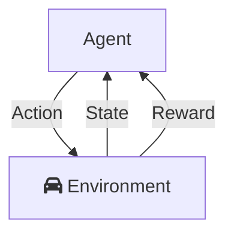

# Modèle

## Définitions

Les éléments essentiels d'un modèle d'apprentissage par renforcement sont:

 - **Policy**: politique. Décrit le comportement de l'agent en fonction de l'état. Table état-action, peut-être déterministe ($a = \pi(s)$ ou stochastique $\pi(a/s) = \mathbb{P}[A_t = a / S_t = s]$
 - **Agent**: doit apprendre la politque optimale **π** pour atteindre le but
 - **Reward**: A chaque étape, l'agent reçoit une récompense. Son but est de maximiser la somme des récompenses.
 - **Retour**: somme des récompenses. Le paramètre $\gamma$ permet de caractériser l'influence des futurs récompenses sur la situation actuelle.

 $
 G = \sum_k \gamma^kR_{t+k+1}
 $

 - **Value function**: prédiction du retour attendu/futur d'un état, ce qui permet de savoir si un état ou un état-action est intéressant.

$
v(s) = \mathbb{E}[G_t / S_t = s] = \mathbb{E}[R_{t+1} + \gamma G_{t+1} / S_t = s] \\
q(s, a) = \mathbb{E}[G_t / S_t = s, A_t = a]\\
$

 - **model** 
   * $\mathcal{P^a_{ss'} = \mathbb{P}[S_{t+1} = s' / S_t = s, A_t = a]}$ prédit le prochain état s' étant donnée une action a et un état s
   * $\mathcal{R^a_s} = \mathbb{E}[R_{t+1} / S_t = s, A_t = a]$ prédit le prochain *reward*/récompense 
 
En général, dans l'apprentissage par renforcement, l'agent intéragit avec une environnement que l'on considère être un MDP (Markov Decision Process).

## Catégories

###

 - Prediction: evaluate the future (Given a policy)
 - Control: optimise the future (Find the best policy)

###

 - On-policy learning
   * “Learn on the job”
   * Learn about policy π from experience sampled from π
 - Off-policy learning
   * “Look over someone’s shoulder”
   * Learn about policy π from experience sampled from μ

###

 - Value Based
   * Value function / No policy (Implicit)
   * Apprend la valeur des action et ensuite sélectionne l'action sur la valeur estimée
 - Policy Based
   * Policy / No value function
   * Sélectionne l'action sans utiliser la fonction valeur
   * Une fonction valeur peut être utilisée pour apprendre les paramètres d'une politique mais n'intervient pas dans le choix de l'action
   * Advantages:
     * Better convergence properties
     * Effective in high-dimensional or continuous action spaces
     * Can learn stochastic policies
   * Disadvantages:
     * Typically converge to a local rather than global optimum
     * Evaluating a policy is typically inefficient and high variance
 - Actor Critic

###

 - Model-Free: Policy and/or Value Function and No Model. 
   * Model-Free Prediction: **Estimer** la fonction valeur à partir d'un MDP _inconnu_
     * Monte Carlo (First Visit Monte Carlo)
     * Temporal Difference (TD)-Learning
   * Model-Free Control: **Optimiser** la fonction valeur à partir d'un MDP _inconnu_
 - Model Based: Policy and/or Value Function and Model

 
### Policy Gradient

